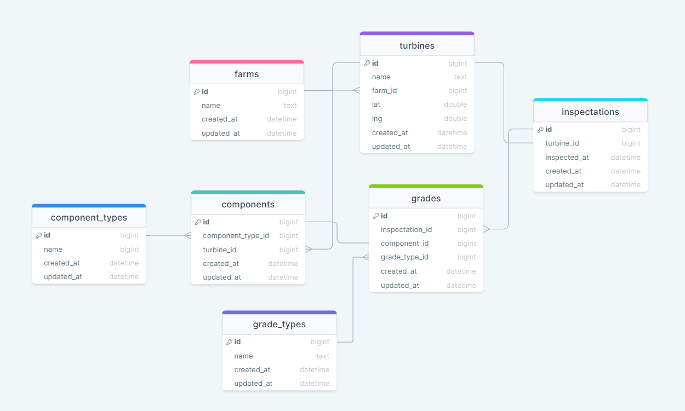

## About Software Development @ Cyberhawk

## The task

We've designed this task to try and give you the ability to show us what you can do and hopefully flex your technical and creative muscles. You can't show off too much here, show us you at your best and wow us!

To make things as simple as we could, we've opted to use [Laravel Sail](https://laravel.com/docs/8.x/sail) to provide a quick and convenient development environment, this will require you to install
[Docker Desktop](https://www.docker.com/products/docker-desktop) before you can start the test. We've provided [some more detailed instructions](#setting-everything-up) below in case this is your first time using Docker or Sail.

We'd like you to build an application that will display an example wind farm, its turbines and their components.
We'd like to be able to see components and their grades (measurement of damage/wear) ranging between 1 - 5.

For example, a turbine could contain the following components:

-   Blade
-   Rotor
-   Hub
-   Generator

Don't worry about using real names for components or accurate looking data, we're more interested in how you structure the application and how you present the data.

Don't be afraid of submitting incomplete code or code that isn't quite doing what you would like, just like your maths teacher, we like to see your working.
Just Document what you had hoped to achieve and your thoughts behind any unfinished code, so that we know what your plan was.

### Requirements

-   Each Turbine should have a number of components ✅
-   A component can be given a grade from 1 to 5 (1 being perfect and 5 being completely broken/missing) ✅
-   Use Laravel Models to represent the Entities in the task. ✅
-   Conform to the spec provided in the `api-spec.yaml` file in the root of this project. ✅
-   If your API matches the spec the provided pre-built front-end should be able to display the data provided via your API ✅

### Bonus Points

-   Automated tests ✅
-   API Authentication 🗣️ - I have detailed below how I would implement this
-   API Authorization 🗣️- I have detailed below how I would implement this
-   Use of coding style guidelines (we use PSR-12 and AirBnb) ✅
-   Use of git with clear logical commits ✅
-   Specs/Plans/Designs ✅

### Submitting The Task

We're not too fussy about how you submit the task, providing it gets to us and we're able to run it we'll be happy however here are some of the ways we commonly see:

-   Fork this repo, work and add us as a collaborator on your GitHub repo and send us a link
-   ZIP the project and email it to us at nick.stewart@thecyberhawk.com

## Setting Everything Up

As mentioned above we have chosen to make use of Laravel Sail as the foundation of this technical test.

-   If you haven't already, you will need to install [Docker Desktop](https://www.docker.com/products/docker-desktop).
-   One that is installed your next step is to install this projects composer dependencies (including Sail).
    -   This will require either PHP 8 installed on your local machine or the use of [a small docker container](https://laravel.com/docs/8.x/sail#installing-composer-dependencies-for-existing-projects) that runs PHP 8 that can install the dependencies for us.
-   If you haven't done so already copy the `.env.example` file to `.env`
    -   If you are running a local development environment you may need to change some default ports in the `.env` file
        -   We've already changed mysql to 33060 and NGINX to 81 for you
-   It should now be time to [start Sail](https://laravel.com/docs/8.x/sail#starting-and-stopping-sail) and the task
-   There is a file in the root of this project called `api-spec.yaml` this can be imported into your application of choice to ensure you're building your application to the spec that we're expecting. Some notable applications are:
    -   Postman
    -   Swagger
    -   StopLight

### Installing Composer Dependencies

https://laravel.com/docs/9.x/sail#installing-composer-dependencies-for-existing-projects

```bash
docker run --rm \
-u "$(id -u):$(id -g)" \
-v $(pwd):/var/www/html \
-w /var/www/html \
laravelsail/php81-composer:latest \
composer install --ignore-platform-reqs
```

### Quick Tips

-   Don't run npm/composer from your host, always run it via the sail command
    -   This is because the docker container may not be able to write to the filesystem after you do so
-   Ensure you have a valid .env file before starting sail for the first time.
    -   Sail creates a docker volume which is persistent, so stopping/starting sail will not affect/fix issues in a volume (missing DB etc)

## Your Notes

Thank you for taking the time to look over my technical test submission. I decided to tackle the backend part of the test, as I wanted to show a complete picture of my experience. My existing portfolio, I feel, already does a good job of demonstrating my knowledge of frontend technology stacks.

Summary of features for technical test:

-   Repositories and Services design pattern
-   Comprehensive Unit and Feature testing: repositories and controllers (40+ test functions)
-   Laravel Pint and Intelephense configured for PSR12
-   Husky (git hooks) configured for Automated Testing and Commit Lint. This runs (or fails) tests with every Git push and checks commit lint during every Git commit.
-   L5 Swagger UI, accessible at /api/documentation, to allow manual testing of the schema.
-   A separate local testing environment, defined in .env.testing.
-   Hosted on Railway.app: https://cyberhawk.james-lomax.com/

## Some things I noticed

I stumbled upon a few minor things:

-   The 'api-spec.yaml' file outlines that endpoints such as "api/farms" use "data: [id,name]", but when referring to a single entity like "api/farms/1", it directly accesses the entity data in the response, skipping the outer "data" in JSON. This causes problems for the built-in frontend, as all the hooks expect "data" (i.e., "return response.data.data"). I chose to keep the return response always with data for each endpoint in this case. 🚨 Unfortunately, this means an automated postman test may fail or produce a warning if you import the api-spec.yaml.

-   Within the "Inspection.jsx" file, it invokes "turbinesShow(inspection.id);" which seems to be a typo or a clever trick. Altering this to "turbinesShow(inspection.turbine_id);" rectified the frontend viewing issue for me.

## How to install and use

🚨 - I have uploaded the solution live to Railway.app (just incase) (takes 10 seconds to load): https://cyberhawk.james-lomax.com/

The local installation of this solution should be as straightforward as the original Git Repo made by yourselves. The only addition is that I have added database seeding for testing the API and for viewing data on the frontend.

On first launch, please run the database migration and seeder via Laravel:

```base
sail artisan migrate
sail db:seed
```

### Video recording and data structure

In case for some reason, the application can not be run. I have screen recorded the inbuilt frontend UI with the implementation working:

https://github.com/James-buzz/technical-test-back-end/assets/16080646/f1867dc9-6bfc-49da-929d-81249569953a

The data structure:



### Bonus: API Authorisation and Authentication

Rather than introducing API authentication / authorisation that could potentially interfere with the existing frontend UI, or crafting additional code that can be succinctly explained in text, I've provided a detailed explanation below of how I would incorporate these features into this application.

-   I would integrate OAuth2 authorisation into the Application using Laravel Passport.
-   I would use Laravel Passport rather than Sanctum because of the flexibility and control that Passport's grant types allow.
-   If users are signing up and logging in directly with the API, the Auth Code Grant could be used.
-   The benefit of Passport: If external websites, services or dashboards require access to the API, a Client Credentials Grant could be used. For example, reporting systems like Tableau or another website already featuring existing user authentication could utilise this grant.

-   To implement User Authentication I would use the inbuilt Laravel features with Laravel Passport and Fortify. I would also include social logins like Google and Facebook. I would change the default functionality of Laravel to Queues. I would then use the inbuilt Laravel Passport routes to implement Auth via Access Tokens and the Authorsation 'Bearer' middleware for grants.

## What would I add further

#### Uploading new Farms, Turbines, etc

-   To upload new farms, turbines and other entities I would start by implementing Laravel's Request classes for the entities. This would refactor the length data validation away from the Controllers.
-   I would create Events and Listeners that subscribe to new Entities being created, or changed and modify their functionality such that they are run under Queueable with Redis. For example, on Farm create, email/notify an admin about the creation.

#### Monitoring and error tracking

-   To monitor the performance of the application, I would install InfluxDB separately, and employ Event Listeners to publish new data points to InfluxDB via a Redis queue. These data points could cover aspects like process duration or controller execution time.
-   I would use something like Sentry to monitor any errors that are uncaught in the application.
-   Integrate a more extension internal logging library and debugging suite. e.g. code coverage.

#### Meilisearch: Full-text search

-   I would integrate Meilisearch into the application by creating new Event Listeners for model/entity updates and creations. These would then be fed into the Meilisearch database via its API. This approach would facilitate the implementation of a full-text search feature on the frontend. Would be run under the Redis Queue to ensure optimisation.

#### Few other bits

-   Staging (Development & Production branches)
-   CI/CD - automated testing via Build Tool
-   Blue/Green deployment or Zero-downtime deployment
-   Laravel Horizon for Queuing and other visualisation tools

## Feedback

I appreciate the opportunity to engage in this excerise; I thought it was very well documented and organised. The README was easy to understand and I understood the solution quickly. The api-spec.yaml was also greatly appreciated, Swagger Editor was a great tool to use this with.

Funnily enough, I previously developed an application very similar to this which was used in an Energy department of engineers. The app was also built In Laravel (Monolith) and would monitor the health status of 100s of power monitors across the business (via an external REST API). The engineers in the team would receive Queue'd alerts via email when monitors were failing and could input notes and condition surveys into the app.
